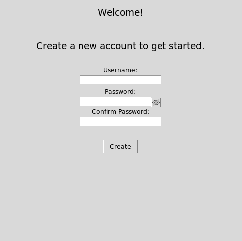
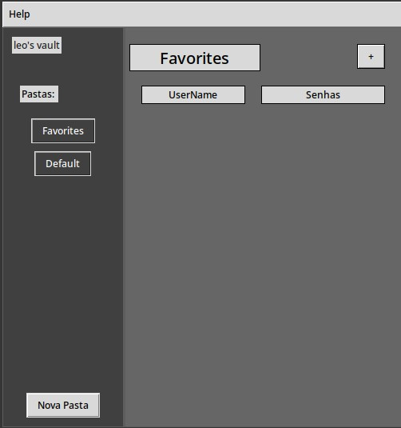

# LoginVault


 Um aplicativo no python para armazenar dados de varias contas

### Dependencias:
 - tkinter
 - pycryptodome
 - passlib
 - bcrypt

 ### Como usar:

 
 1) instale todas as dependencias necessarias<br/>
 ```
 pip install pycryptodome passlib bcrypt
 ```
 2) clone o repositorio e execute o arquivo main.py
 ```
 git clone https://github.com/Knightleo602/LoginVault.git

 python LocalVault/src/main.py
 ```

 3) ao abrir pela primeira vez, voce devera criar uma nova conta mestre

    

 4) ao criar uma conta, o sistema automaticamente cria duas pastas para voce, para adicionar mais, clique no botao "New Folder"

    

 5) para salvar um novo login, clique no + no canto superior direito

 6) os logins serao automaticamente carregados na tela, para ver a senha, deixe o mouse em cima do quadrado


 
 
